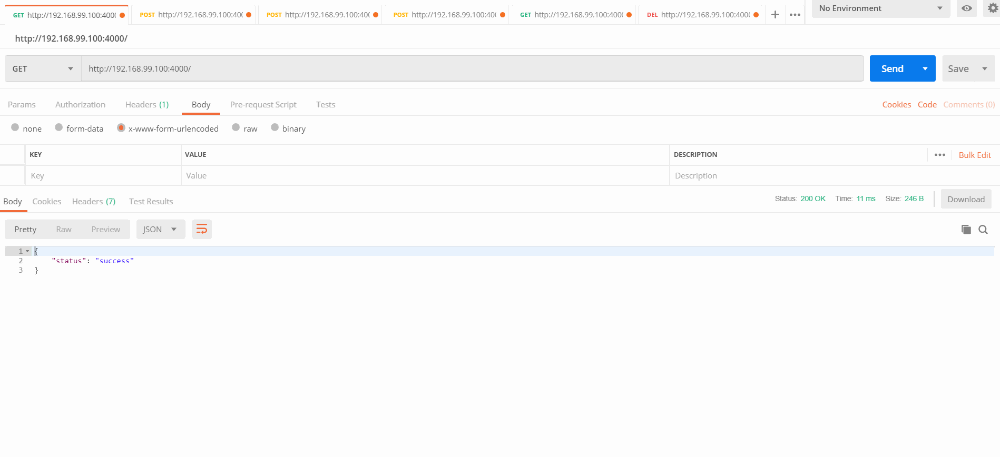

# **Hackerbay Server Monitoring Project - BackEnd**

Hackerbay is a app that monitors your website, dashboards, API's and alerts your team when downtime happens. When the user logs in, user is navigated to dashboard and user can monitor and do configurations there.

This is the Backend part of the Server Monitoring Project. Frontend part can be found on [Hackerbay - FrontEnd.](https://github.com/SandunWebDev/hackerbay-frontend/)

See Live Demo at [HackerbayApp.ml](http://HackerbayApp.ml) that deployed in Google Clouds Kubernetes Engine.

  

---
## 	**Project Build Dashboards**

  This project use Travis CI/CD pipeline with Docker Containerization, Kubernetes and Automated Testing for Continues Deployment. 

- [Travis CI/CD Builds](https://travis-ci.com/SandunWebDev/hackerbay)
- [Docker Hub Images](https://cloud.docker.com/repository/docker/sandunwebdev/hb-backend-image-prod)
- [Code Coverage](https://codecov.io/gh/SandunWebDev/hackerbay)

---
## **Used Technologies**

| FrontEnd                                                                        | BackEnd                  | Tools                           | Other              |
| ------------------------------------------------------------------------------- | ------------------------ | ------------------------------- | ------------------ |
| See [Hackerbay - Frontend](https://github.com/SandunWebDev/hackerbay-frontend/) | NodeJS + Express         | Mocha + Chai + Sinon + Istanbul | Docker             |
|                                                                                 | Postgres + Sequalize     | ESLint + Prettier      | Kubernetes |
|                                                                                 | Passport + BCryprt + JWT |                                 | TravisCI + CodeCov
|                                                                                 | Twilio API   |                                 | Google Cloud Engine   
|                                                                                 | CronJobs   |                                 | Postman

---
## **How To Run**

### # USING KUBERNETES
- Get this projects Kubernetes Configs at [here](https://github.com/SandunWebDev/hackerbay-kubernetes) and follow the instructions.

### # IF YOU HAVE DOCKER
- Just run `npm run docker:dev:run`. It will install and run all the dependencies and services (Postgres Database, Admin Panel, etc...) need to run this project. Then you can interact with the program through http://localhost:4000.

- Also already built "Docker Images" of this project can be found in [here](https://cloud.docker.com/repository/docker/sandunwebdev/hb-backend-image-prod).

### # USING NORMAL WAY
- Run `npm install` to install dependencies.
- Then run `npm start`.
- Normally you can interact with program through http://localhost:4000.
- NOTE : Make sure postgre server is already running. In dev mode, by default it connect to "hackerbay" database with username "devadmin". If needed change default values in "./configs/main.js" or pass specific env. varaiables.

### **NOTE** : Make sure `".env"` file is filled with necessary values.
---
## **How To Test**

- `npm test` - Run full test suite with coverage. (Unit + Integration)
- `npm run test:unit` - Only run unit tests in watch mode.
- `npm run test:integration` - Only run integration tests in watch mode.
- `npm run test:all` - Run all tests in watch mode.

---
## API Summery

|Path|Request Type|Request Body|Sucess Response Body|Failure Response Body|Description|
|---|---|---|---|---|---|
|http://localhost:4000/|GET|--|`{status: "success"}`|`{success: false, errMsg: "ERROR_DES"}`|Root path. User get confirmation about server is alive and connection is succssful.|
|||||||
|http://localhost:4000/data|POST|`{data: "ANY_STRING"}`|`{data: "SAVED_DATA"}`|`{success: false, errMsg: "ERROR_DES"}`|Save data provided in body. These saved data can be accessed through "/data" GET request. (For Testing Purposes)|
|http://localhost:4000/data|GET|--|`{data: "SAVED_DATA"}`|`{success: false, errMsg: "ERROR_DES"}`|Send user's stored data in server which we recived in "/data" POST request. (For Testing Purposes)|
|||||||
|http://localhost:4000/user/signup|POST|`{name : "ANY_NAME", email : "VALID_EMAIL", password: "VALID_PASSWORD", phoneNum: "VALID_NUM"}`|`{success: true, session : "SESSION_TOKEN", name: "VALIDATED_NAME",  email: "VALIDATED_EMAIL"}`|`{success: false, errMsg: "ERROR_DES"}`|User can create an account providing valid name, email, password, phone number. When sucessful user recieve token which can be used to authenticate next requests.|
|http://localhost:4000/user/login|GET|`{email : "PROVIDED_EMAIL", password: "PROVIDED_PASSWORD"}`|`{success: true, session : "SESSION_TOKEN", name: "VALIDATED_NAME",  email: "VALIDATED_EMAIL"}`|`{success: false, errMsg: "ERROR_DES"}`|User can login using already created user account details. If email exist and password matches user recieve token which can be used to authenticate next requests.|
|||||||
|http://localhost:4000/website/add|POST|`{token : "VALID_TOKEN", websiteName: "SOME_NAME", url:"VALID_URL"}`|`{success: true", added": {"id": "ENTRY_ID","userId": "USER'S ID","websiteName": "PROVIDED_NAME", "url": "PROVIDED_URL", "onlineStatus": TRUE/FALSE, "updatedAt": "DATE", "createdAt": "DATE"}`|`{success: false, errMsg: "ERROR_DES"}`|When user send a request with valid token and necessary data this creates entry in database with provided data.
|http://localhost:4000/website/delete|DELETE|`{token : "VALID_TOKEN", websiteItemId: "ENTRY'S DATABASE ID"}`|`{"success": true, "deletedWebsiteItemId": "DELETED_ITEM_ID"}`|`{success: false errMsg: "ERROR_DES"}`|When user send a request with valid token and necessary data this delete specified entry in database.|
|http://localhost:4000/website/list|GET|`{token : "VALID_TOKEN"}`|`{"success": true, "result": [....., ......]}`|`{success: false, errMsg: "ERROR_DES"}`|When user send a request with valid token this returns array of websites registred to that user.| 

---